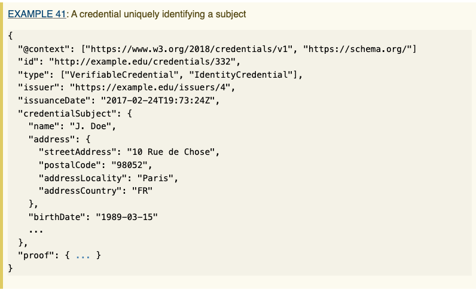
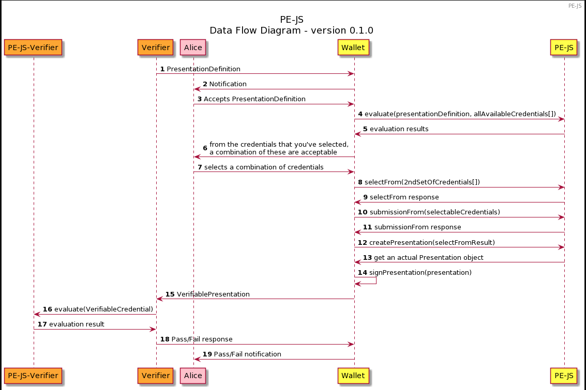

1.  [BloXmove Dev](index.html)
2.  [Architecture
    Overview](Architecture-Overview_4492492808.html)

#  BloXmove Dev : Verifiable Credential / Verifiable Presentation 

Created by  Hartmut Obendorf, last modified
by  Kevin Kuhfeldt on Nov 29, 2021

**MinAge18Type, MinAge21Type,
MinAge25Type**

I could not find any VC's in a similar format. (e.g minAge18: true or
minAge21: true) → maybe because of potential selective disclosure ?

W3.org (<https://www.w3.org/TR/vc-imp-guide/#zero-knowledge-proofs> ):

Using zero-knowledge methods, predicate proofs can be generated by
the [holder](https://www.w3.org/TR/vc-imp-guide/#dfn-holders) at the
time
of [presentation](https://www.w3.org/TR/vc-imp-guide/#dfn-presentations) without [issuer](https://www.w3.org/TR/vc-imp-guide/#dfn-issuers) involvement.
For example, a [verifiable
credential](https://www.w3.org/TR/vc-imp-guide/#dfn-verifiable-credentials) with
the [claim](https://www.w3.org/TR/vc-imp-guide/#dfn-claims) birthdate
can be used in a [verifiable
presentation](https://www.w3.org/TR/vc-imp-guide/#dfn-verifiable-presentations) to
prove age-over-18. The
same [credential](https://www.w3.org/TR/vc-imp-guide/#dfn-credential) could
then be used in
another [presentation](https://www.w3.org/TR/vc-imp-guide/#dfn-presentations) to
prove age-over-25, all without revealing
the [holder's](https://www.w3.org/TR/vc-imp-guide/#dfn-holders) birthdate.

All credentials regarding an age looked like this:

**driverLicenseType**

Also for driver’s license:

Sphereon library (based on
<https://identity.foundation/presentation-exchange/> )

1.  Presentation → can have multiple requested and and from user
    selected VC's

2.  One presentation is sent to the verifier

3.  The user picks the requested VC's from his wallet and put it into
    the VP.

## Attachments:

[image-20211129-150600.png](attachments/4494458942/4494524471.png)
(image/png)  

[image-20211129-151415.png](attachments/4494458942/4494524479.png)
(image/png)  

[image-20211129-151553.png](attachments/4494458942/4494295282.png)
(image/png)  

Document generated by Confluence on Apr 20, 2022 13:42

[Atlassian](http://www.atlassian.com/)

