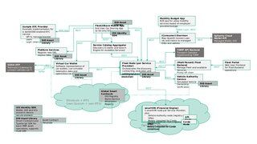

1.  [BloXmove Dev](index.html)

#  BloXmove Dev : Architecture Overview 

Created by  Jan-Paul Buchwald, last modified
by  Hartmut Obendorf on Dec 09, 2021

TODO Links to (updated) single component descriptions and detail
information

-----

Source pptx file:

## Attachments:

[2021-11-15\_bloXmove\_Platform-Architecture.jpg](attachments/4492492808/4492525586.jpg)
(image/jpeg)  

[2021-11-15\_bloXmove\_Platform-Architecture.pptx](attachments/4492492808/4492591105.pptx)
(application/vnd.openxmlformats-officedocument.presentationml.presentation)  
 [bloXmove
Architecture.drawio](attachments/4492492808/4496523310.drawio)
(application/vnd.jgraph.mxfile)  
 [bloXmove
Architecture.drawio.png](attachments/4492492808/4496359557.png)
(image/png)  
 [\~bloXmove
Architecture.drawio.tmp](attachments/4492492808/4496719907.tmp)
(application/vnd.jgraph.mxfile)  
 [bloXmove
Architecture.drawio](attachments/4492492808/4496687172.drawio)
(application/vnd.jgraph.mxfile)  
 [bloXmove
Architecture.drawio.png](attachments/4492492808/4496752705.png)
(image/png)  
 [\~bloXmove
Architecture.drawio.tmp](attachments/4492492808/4496785450.tmp)
(application/vnd.jgraph.mxfile)  
 [\~bloXmove
Architecture.drawio.tmp](attachments/4492492808/4496719925.tmp)
(application/vnd.jgraph.mxfile)  
 [\~bloXmove
Architecture.drawio.tmp](attachments/4492492808/4496752677.tmp)
(application/vnd.jgraph.mxfile)  
 [\~bloXmove
Architecture.drawio.tmp](attachments/4492492808/4496752691.tmp)
(application/vnd.jgraph.mxfile)  
 [\~bloXmove
Architecture.drawio.tmp](attachments/4492492808/4496359552.tmp)
(application/vnd.jgraph.mxfile)  
 [bloXmove
Architecture.drawio](attachments/4492492808/4493770778.drawio)
(application/vnd.jgraph.mxfile)  
 [bloXmove
Architecture.drawio.png](attachments/4492492808/4493770784.png)
(image/png)  

Document generated by Confluence on Apr 20, 2022 13:42

[Atlassian](http://www.atlassian.com/)

