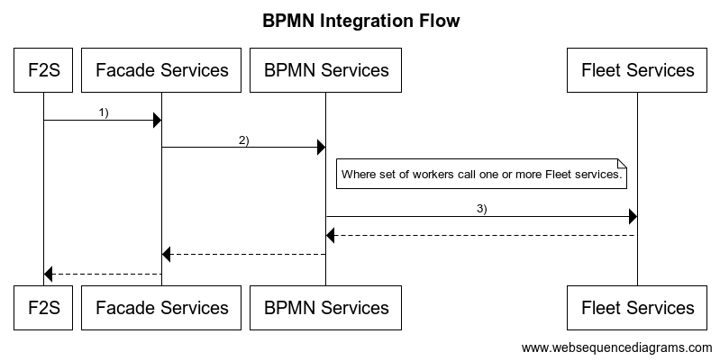

1.  [BloXmove Dev](index.html)
2.  [Architecture
    Overview](Architecture-Overview_4492492808.html)

#  BloXmove Dev : Business Process Modeling and Engine 

Created by  Jan-Paul Buchwald (Unlicensed),
last modified on Dec 18, 2021

In order to establish a common language between business and technical
implementation, as well as improve the structure, maintainability and
re-usability of the source code, a business process execution engine can
be used to orchestrate the main business logic based on workflows
modelled in the BPMN 2.0
(<https://www.omg.org/spec/BPMN/2.0/About-BPMN/>) notation.

## Architecture Principle

The following diagram shows the usage of a business process engine in
the context of the Fleet2Share scenario: both Service Consumer (User
Mobility App) and Service Provider (Fleet Node) have a business process
engine embedded. The Service Consumer basically triggers the Human Tasks
and exchanges messages with the Service Provider part of the process,
which could be routed through some REST API Facade on the Service
Provider side.

The main business logic is realised by Service Tasks in the process of
the Service Provider. The Service Tasks can be implemented by code
running on the same machine, or by calling remote (micro-)services via a
service connector. This allows to provide predefined building blocks of
task implementations or service calls that can be re-used in many
business processes.

The BPMN diagram is modelled graphically using a tool like [Camunda
Modeler](https://camunda.com/download/modeler/), which includes
references of tasks to particular implementation classes, functions, or
service calls. It is then exported as an XML document which can be
imported to the business process engine, and executed assumed that all
referenced implementations and service connectors are available in the
context of the execution engine.

## Points of Discussion

  - Protocol to communicate between participants of the process
    
      - Synchronous HTTP (REST, GraphQL)
    
      - Synchronous WebSockets
    
      - Asynchronous Messages (WebSockets, Message Queue)

  - Particular implementation of business process engine
    
      - Basically all enterprise BPMN engines are based on Java (most
        prominent [Camunda](https://camunda.com/)), would require to
        migrate most of the MBP stack to Java if Service Tasks should be
        implemented with code
    
      - Alternative would be to use a stand-alone BPMN engine as a pure
        service orchestrator, e.g. [Zeebe](https://zeebe.io/), and
        provide the required steps as micro-service operations
    
      - There is a BPMN engine implementation in JavaScript
        (<https://www.npmjs.com/package/bpmn-engine>), however this
        seems to be a rather lightweight single-maintainer project that
        should be carefully evaluated before usage in an enterprise
        context

## Evaluation of Business Process Engines

Based on the last discussion point of the previous section, the
`bpmn-engine` npm library and Zeebe were evaluated in more detail. The
evaluation mainly comprised a sample code project for each of the two,
the results have been packaged and briefly documented in the attached
source code project mbp-bpmn-samples.

The evaluation revealed **Zeebe** as a suitable solution allowing an
independent management and orchestration of business process with good
integration into many programming languages and frameworks, including
nest.js. Processes can be modelled using the [Zeebe
Modeler](https://github.com/zeebe-io/zeebe-modeler/releases), which
supports only a subset of the full BPMN notation. However this is not
considered a limitation, since automated steps are modelled with service
tasks that are implemented by so-called [job
workers](https://docs.zeebe.io/basics/job-workers.html), and
asynchronous interruptions of the process (e.g. human interaction) are
modelled with events that can be triggered using the Zeebe API.

The `bpmn-engine` disqualified due to the fact that it is a pure
execution engine that does not come with state handling or persistence,
only allowing to serialize and deserialize process state in order to
implement own persistence mechanisms.

## Next Steps

As a next step, Zeebe should be further explored in practice with a real
use case, starting by modelling the respective business process with
Zeebe modeler, and then implementing the single service tasks as
reusable job worker functions.

## Attachments

| **File**                                                                                                                                          | **Description**                                                                                                                                                                                                                                                                                                   | **Date**   | **Authors**                                                                                                                         |
| ------------------------------------------------------------------------------------------------------------------------------------------------- | ----------------------------------------------------------------------------------------------------------------------------------------------------------------------------------------------------------------------------------------------------------------------------------------------------------------- | ---------- | ----------------------------------------------------------------------------------------------------------------------------------- |
|  | Excel List of process steps for vehicle rental and vehicle registrations                                                                                                                                                                                                                                          | 2020-07-28 | [Jan-Paul Buchwald (Unlicensed)](https://bloxmove.atlassian.net/wiki/people/5a50d761e067544f89dbeeb1?ref=confluence)                |
|                              | The Fleet Backend should not be (as possible as it can be) not be change when integrating the BPMN Engine, to save efforts and reusability for other workflow and workers. A Facade Services that can contain one or more few calls to BPMN services is necessary to make it compact and business focus services. | 2020-10-29 | [david batalla (Unlicensed)](https://bloxmove.atlassian.net/wiki/people/557058:7f3b2055-058a-4f86-85ad-d96a999d85a4?ref=confluence) |

## Attachments:

[BusinessProcessEngine-v0.1.jpg](attachments/1656159887/1660714626.jpg)
(image/jpeg)  

[2020-07-28-MBP-Process-steps.xlsx](attachments/1656159887/2047213161.xlsx)
(application/vnd.openxmlformats-officedocument.spreadsheetml.sheet)  

[2020-07-28-MBP-Process-steps.xlsx](attachments/1656159887/2047147625.xlsx)
(application/vnd.openxmlformats-officedocument.spreadsheetml.sheet)  
 [BPMN Integration
Flow.png](attachments/1656159887/2295791209.png) (image/png)  

[mbp-bpmn-samples.zip](attachments/1656159887/4498260008.zip)
(application/zip)  

Document generated by Confluence on Apr 20, 2022 13:42

[Atlassian](http://www.atlassian.com/)

