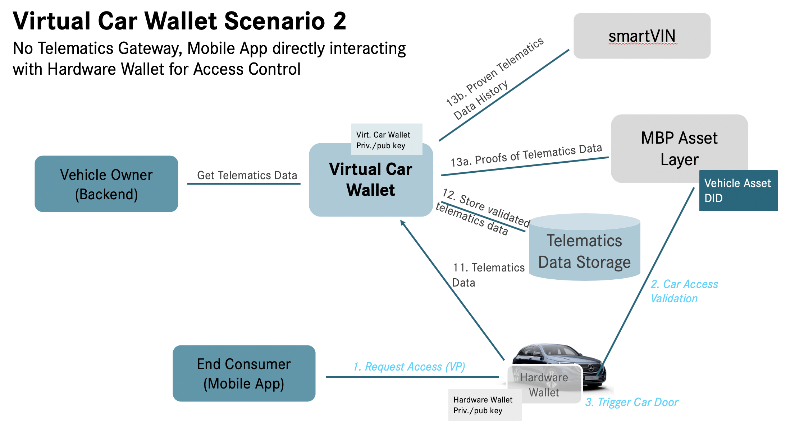

1.  [BloXmove Dev](index.html)
2.  [Architecture
    Overview](Architecture-Overview_4492492808.html)

#  BloXmove Dev : Car access mechanisms 

Created by  Alexander Balz, last modified by
 Jan-Paul Buchwald (Unlicensed) on May 04,
2020

Car access can be either controlled via the Virtual Car Wallet connected
to a Telematics Gateway, or using a Hardware Car Wallet directly in the
car.

Together with different options for gathering telematics data from the
car, this results in the following three scenarios (also see original
slides as attachment to this page):

## 1\) Virtual Car Wallet for Access Control, Hardware Wallet for Telematics Data

## 2\) No Telematics Gateway, Mobile App directly interacting with Hardware Wallet for Access Control

## 3\) Virtual Car Wallet for Access Control and Telematics Data, no Hardware Wallet

The favoured approach is scenario 2, however due to restrictions in
terms of in-car security the “mixed” scenario 1 is likely for the
European Union. For testing and development, we currently employ
scenario 3 with a simulated/mocked telematics gateway and telematics
box.

## Attachments:

[image-20200504-143324.png](attachments/1575517803/1812397679.png)
(image/png)  

[image-20200504-143324.png](attachments/1575517803/1812102772.png)
(image/png)  

[image-20200504-143350.png](attachments/1575517803/1812332143.png)
(image/png)  

[image-20200504-143410.png](attachments/1575517803/1812168301.png)
(image/png)  
 [2020-04-17-MBPv1.0-Car Wallet
Options.pptx](attachments/1575517803/1812233848.pptx)
(application/vnd.openxmlformats-officedocument.presentationml.presentation)  

Document generated by Confluence on Apr 20, 2022 13:42

[Atlassian](http://www.atlassian.com/)

