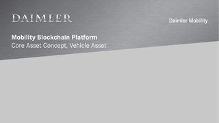
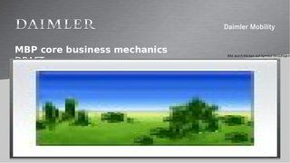

1.  [BloXmove Dev](index.html)
2.  [Architecture
    Overview](Architecture-Overview_4492492808.html)

#  BloXmove Dev : Core mechanisms 

Created by  Alexander Balz, last modified by
 Jan-Paul Buchwald on Sep 07, 2021

<table>
<thead>
<tr class="header">
<th>
<strong>Presentation</strong>
</th>
<th>
<strong>Version</strong>
</th>
<th>
<strong>Authors</strong>
</th>
</tr>
</thead>
<tbody>
<tr class="odd">
<td>
MBP 1.0 Core Concepts Extract with Focus on DID and Vehicle Asset

</td>
<td>
2020-10-12
</td>
<td>
<a href="https://bloxmove.atlassian.net/wiki/people/5a50d761e067544f89dbeeb1?ref=confluence" class="confluence-userlink user-mention">Jan-Paul Buchwald (Unlicensed)</a>
</td>
</tr>
<tr class="even">
<td>
MBP v1.0 Core Concepts - Asset Architecture + DID/VC, KYC, Virtual Car Wallet, Contracting Flow, B2C + B2B Scenarios

</td>
<td>
2020-04-06
</td>
<td>
<a href="https://bloxmove.atlassian.net/wiki/people/5a50d761e067544f89dbeeb1?ref=confluence" class="confluence-userlink user-mention">Jan-Paul Buchwald (Unlicensed)</a>
</td>
</tr>
<tr class="odd">
<td>
MBP v1.0 Core Business Mechanics

</td>
<td>
2019-11-11
</td>
<td>
<a href="https://bloxmove.atlassian.net/wiki/people/5ccc04584fe7f511781d89aa?ref=confluence" class="confluence-userlink user-mention">Thomas Herbst (Unlicensed)</a> <a href="https://bloxmove.atlassian.net/wiki/people/5a50d761e067544f89dbeeb1?ref=confluence" class="confluence-userlink user-mention">Jan-Paul Buchwald (Unlicensed)</a>
</td>
</tr>
</tbody>
</table>

## Attachments:

[191111\_MBPv1.0\_CoreBusinessMechanics.pptx](attachments/1593933450/1812135540.pptx)
(application/vnd.openxmlformats-officedocument.presentationml.presentation)  

[2020-04-06-MBPv1.0-Core-Concepts-FINAL.pdf](attachments/1593933450/1812266617.pdf)
(application/pdf)  

[2020-04-06-MBPv1.0-Core-Concepts-FINAL.pptx](attachments/1593933450/1806761588.pptx)
(application/vnd.openxmlformats-officedocument.presentationml.presentation)  

[191111\_MBPv1.0\_CoreBusinessMechanics.pptx](attachments/1593933450/1593769615.pptx)
(application/vnd.openxmlformats-officedocument.presentationml.presentation)  

[2020-10-12-MBPv1.0-Core-Concepts-Vehicle-DID-Elia.pdf](attachments/1593933450/4459823387.pdf)
(application/pdf)  

Document generated by Confluence on Apr 20, 2022 13:42

[Atlassian](http://www.atlassian.com/)

