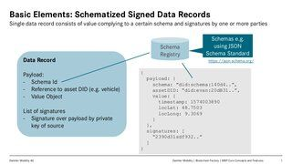

1.  [BloXmove Dev](index.html)
2.  [Architecture
    Overview](Architecture-Overview_4492492808.html)

#  BloXmove Dev : Safe Storage Module 

Created by  Jan-Paul Buchwald (Unlicensed)
on May 04, 2020

The Safe Storage Module is an independent component of the MBP that can
be used to efficiently store large amounts of data (e.g. raw telematics
data from vehicles) off-chain and link them to on-chain timestamped
proofs based on hash trees.

The basic idea, concept and examples are described in the following
presentation.

| **File**                                                                                                                                         | **Version**         | **Authors**                                                                                                                                                                                                                                         |
| ------------------------------------------------------------------------------------------------------------------------------------------------ | ------------------- | --------------------------------------------------------------------------------------------------------------------------------------------------------------------------------------------------------------------------------------------------- |
|  | DRAFT 2, 2020-04-16 | [Jan-Paul Buchwald (Unlicensed)](https://bloxmove.atlassian.net/wiki/people/5a50d761e067544f89dbeeb1?ref=confluence) [harry.h.behrens@daimler.com (Unlicensed)](https://bloxmove.atlassian.net/wiki/people/5b68aeff2ba0e03be0531baa?ref=confluence) |
|                                                                                                                                                  |                     |                                                                                                                                                                                                                                                     |

## Attachments:

 [2020-04-16-MBPv1.0-Safe Storage
Module-DRAFT2.pdf](attachments/1812299375/1812070000.pdf)
(application/pdf)  

Document generated by Confluence on Apr 20, 2022 13:42

[Atlassian](http://www.atlassian.com/)

