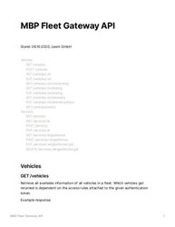

1.  [BloXmove Dev](index.html)
2.  [Architecture
    Overview](Architecture-Overview_4492492808.html)

#  BloXmove Dev : Vehicle Integration and Management 

Created by  Jan-Paul Buchwald (Unlicensed),
last modified on Aug 05, 2021

This page collects architectural options and input for the management
and integration of vehicles including related data and services.

## Fleet Gateway

Input provided by Leam

|                        |                                                                                                                                                   |
| ---------------------- | ------------------------------------------------------------------------------------------------------------------------------------------------- |
| REST API Specification |   |
| Architectural Scheme   |  |

Architecture corresponds to a combination / subset of existing
(simulated) Fleet Backend and Virtual Car Wallet components, detailed
integration with MBP is not yet defined.

## Vehicle Onboard Unit Integration

Input provided by Nantis

|                                                                                                                                                   |                              |
| ------------------------------------------------------------------------------------------------------------------------------------------------- | ---------------------------- |
|  | Concept Document Version 0.2 |

Focusses on integration of physical car wallet based on OLU (On-board
Logic Unit) Connect Box.

Suggested approach in two steps: first access / integration via a
“Virtual Car Application” (corresponds to Virtual Car Wallet), then
direct handling in Physical Car Application

## Hackathon Prototype With Sodacars

Integration of a real Smart vehicle using the Soda
(<https://sodacar.com/>) Mobility Platform Backend and an xToolTech TBox
based on the existing Virtual Car Wallet Architecture and Fleet2Share
scenario.

Code for Virtual Car Wallet Extension allowing flexible Fleet Gateway
Adapters, as an example implementing a *SodaAdapter* accessing a REST
API provided by Soda:

<https://github.com/bloxmove-com/virtual-car-wallet/blob/master/src/adapters/soda-adapter.class.ts>

### Architecture and Requirements for a production-ready Setup

The scenario outlined in the Hackathon can be simplified by controlling
both the read access (getting telematics data) and the “write” access
(changing state of the car, in our scenario open/close car doors)
through the virtual car wallet. This would result in the following basic
architecture and requirements for a SODA telematics gateway that can be
called by the MBP virtual car wallet component.

## Attachments:

[20201006-MBP\_Fleet\_Gateway\_API.pdf](attachments/2335342185/2335342196.pdf)
(application/pdf)  
 [Sharing Fleet MBP\_ T-Box Integration
Prinzipskizze.pptx](attachments/2335342185/2335407723.pptx)
(application/vnd.openxmlformats-officedocument.presentationml.presentation)  

[image-20201110-121010.png](attachments/2335342185/2335735403.png)
(image/png)  

[image-20201110-121028.png](attachments/2335342185/2335637100.png)
(image/png)  
 [MBP - OLU Client -
Concept.nantis.docx](attachments/2335342185/2335735409.docx)
(application/vnd.openxmlformats-officedocument.wordprocessingml.document)  

[image-20201110-121612.png](attachments/2335342185/2335604333.png)
(image/png)  

[OLU-Virtual.png](attachments/2335342185/2335506027.png) (image/png)  

[OLU-Direct.png](attachments/2335342185/2335833707.png) (image/png)  

[Wanxiang-Hackathon-Architecture.png](attachments/2335342185/2335309423.png)
(image/png)  
 [2021-05-06-SODA Telematics
Gateway.png](attachments/2335342185/4334780636.png) (image/png)  
 [2021-06-03-SODA Telematics
Gateway.png](attachments/2335342185/4446126123.png) (image/png)  

Document generated by Confluence on Apr 20, 2022 13:42

[Atlassian](http://www.atlassian.com/)

