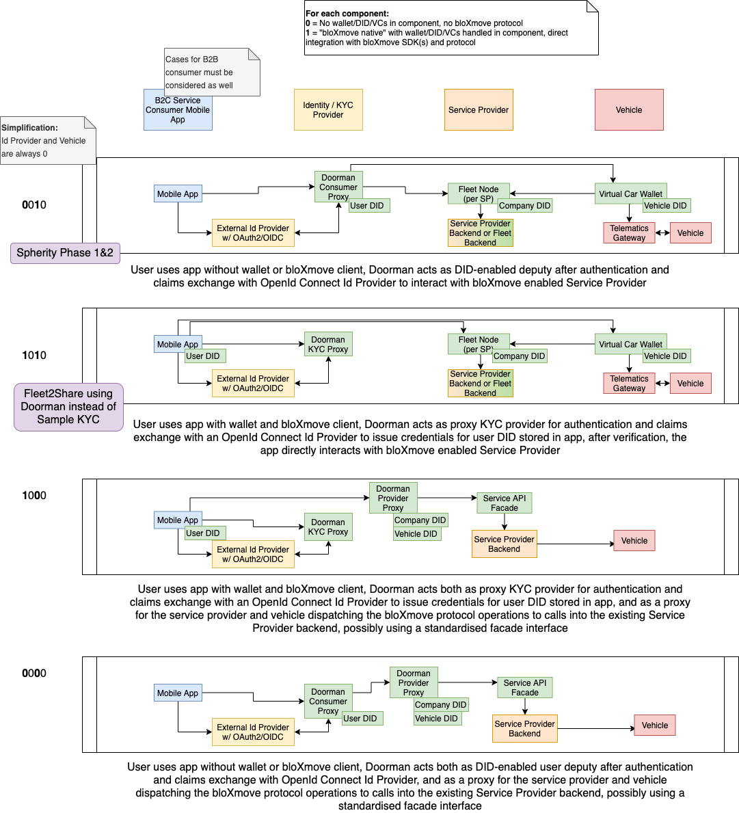
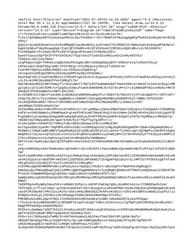

1.  [BloXmove Dev](index.html)
2.  [Architecture
    Overview](Architecture-Overview_4492492808.html)

#  BloXmove Dev : bloXmove Protocol Integration Scenarios 

Created by  Jan-Paul Buchwald (Unlicensed),
last modified on Dec 18, 2021

Overview and implementation sketches of different technical scenarios
how the relevant roles and actors (Service Consumers, KYC/Identity
Providers, Service Providers, Vehicles) can be integrated into the
bloXmove protocol.

## Attachments:

[bloXmove-Integration-Scenarios-v0.1.png](attachments/4438982941/4439114038.png)
(image/png)  

[bloXmove-Integration-Scenarios.drawio](attachments/4438982941/4498292845.drawio)
(application/octet-stream)  

Document generated by Confluence on Apr 20, 2022 13:42

[Atlassian](http://www.atlassian.com/)

